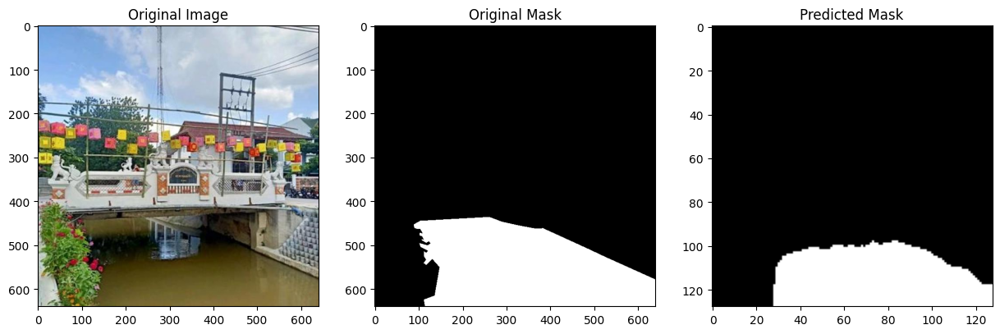
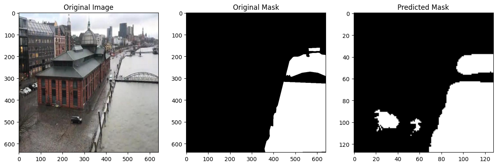

# Segformer Project

This project focuses on water flood segmentation using the Segformer model.

## Table of Contents
- [Introduction](#introduction)
- [Installation](#installation)
- [Usage](#usage)
- [Results](#results)
- [Contributing](#contributing)
- [License](#license)

## Introduction
This project aims to segment water flood areas using the Segformer model, a state-of-the-art transformer-based architecture for semantic segmentation.

## Installation
To install the necessary dependencies, run:
```bash
pip install -r requirements.txt
```

## Usage
To train the Segformer model, use the following command:
```bash
python scripts/train.py --dataset path/to/dataset --batch_size 8 --epochs 10 --learning_rate 5e-5 --output_dir ./output
```

To evaluate the Segformer model, use the following command:
```bash
python scripts/evaluate.py --model_name_or_path ./output --dataset_name path/to/dataset --batch_size 8
```

## Results
The results of the segmentation will be saved in the `visualization_ouputs` directory.

- 
  
- 
  

## Contributing
Contributions are welcome! Please open an issue or submit a pull request.

## License
This project is licensed under the MIT License.
```

